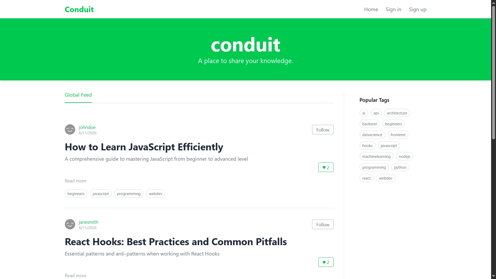
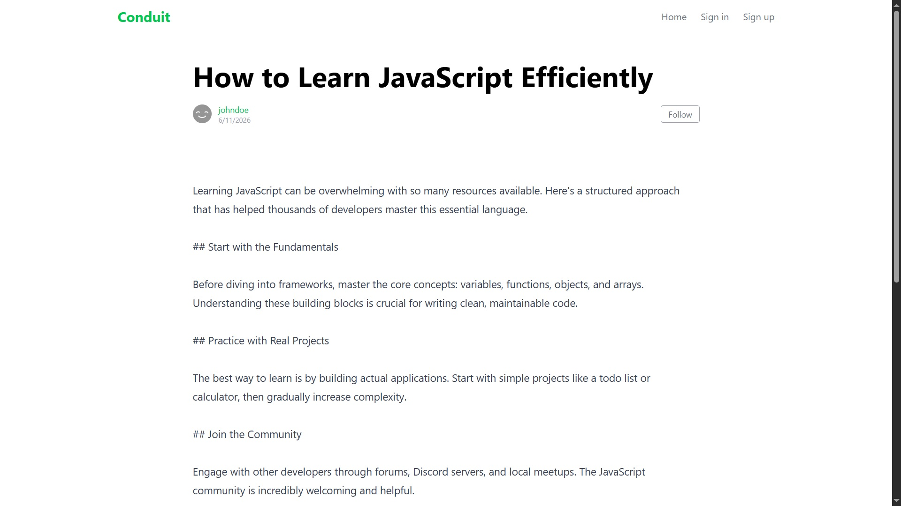
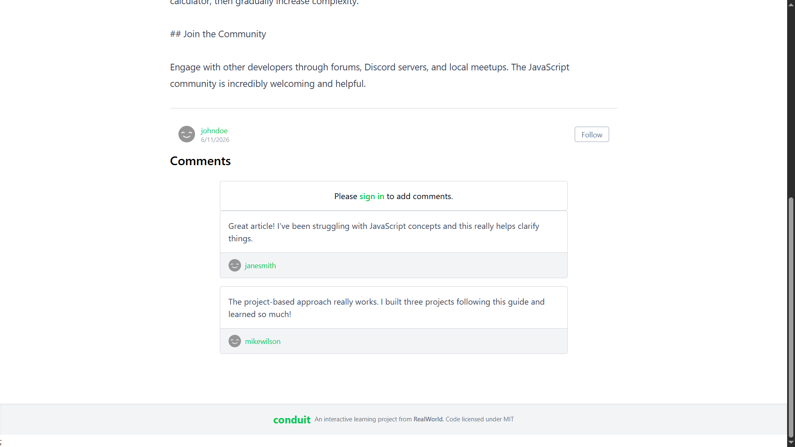
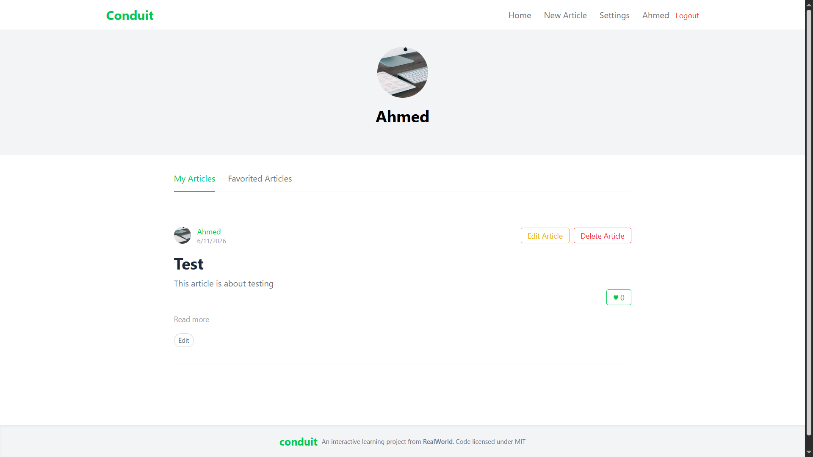
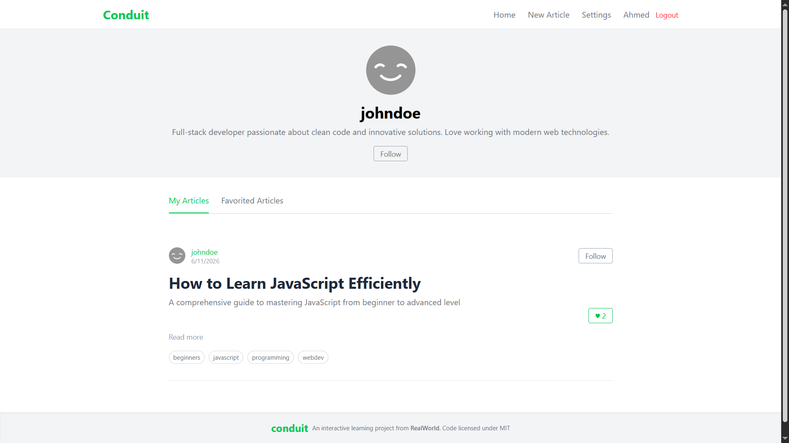
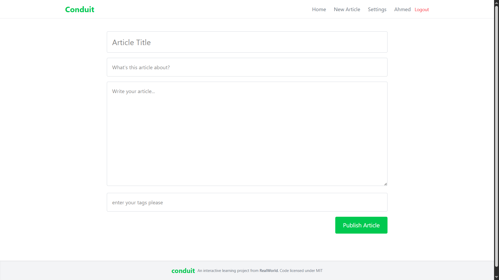
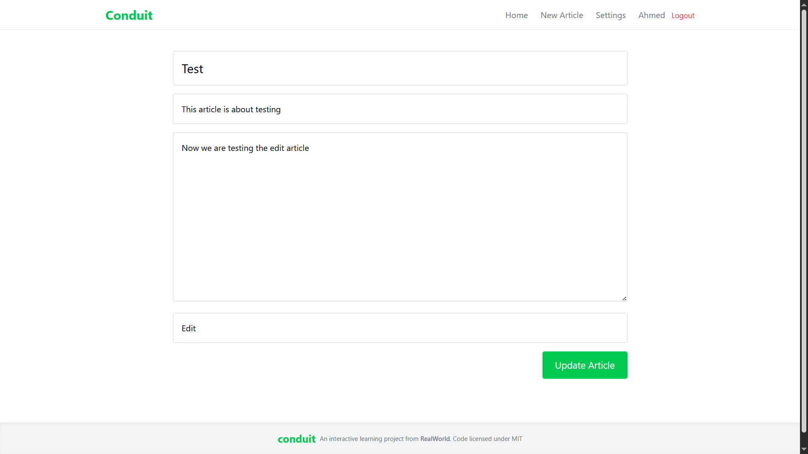
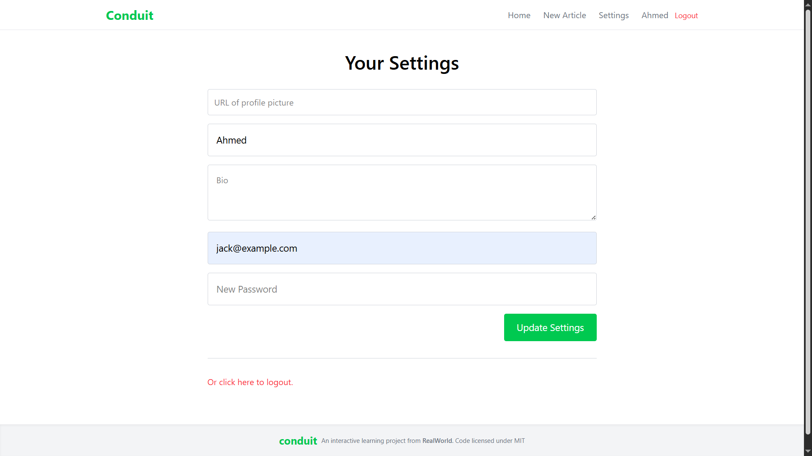

# Conduit

A full-featured RealWorld Conduit clone built with React, TypeScript, React Query, React Router, Tailwind CSS, and Vercel.

## Live Demo

[View Live Application](https://conduit-ahmedsameh312.vercel.app/)

## Features

- Authentication (Register/Login/Logout)
- Protected Routes
- Global Feed
- Personal Feed
- Article Pagination
- Create Articles
- Edit Articles
- Delete Articles
- Favorite / Unfavorite Articles
- User Profiles
- Follow / Unfollow Users
- Article Comments
- Settings Management
- Tag Filtering
- React Query Caching
- Toast Notifications

## Tech Stack

### Frontend

- React 19
- TypeScript
- React Router
- React Query
- Tailwind CSS
- Axios
- React Hook Form
- Zod

### Deployment

- Vercel

## Screenshots

### Home Page



### Article Page




### Profile Page




### Editor Page




### Settings Page



## Installation

```bash
git clone https://github.com/ahmedsameh312/conduit

cd conduit

pnpm install

pnpm dev
```

## Build

```bash
pnpm build
```

## Author

Ahmed Sameh
